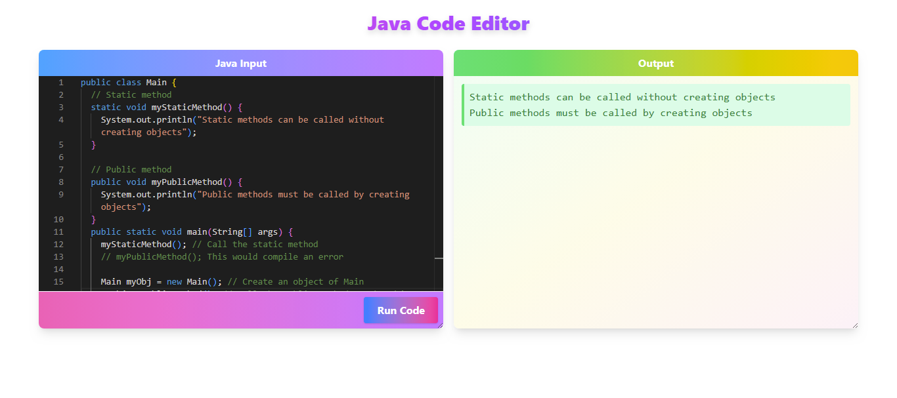

# Java Code Editor 2

 

---

A modern, full-stack web application for writing, compiling, and running Java code directly in your browser. Built with React, Express, and Node.js.

## 🚀 Features

- Syntax-highlighted Java code editor (powered by Monaco/React)
- Real-time code compilation and output
- Error and runtime feedback
- Responsive, dynamic UI
- Secure backend code execution

## ✅ Why use Monaco ?

- It’s the same editor used in VS Code

#### Supports: 

- Syntax highlighting

- Error checking

- Autocompletion (some)

- Themes (dark/light)

- Language-specific behaviors (Java, in our case)

## 🖥️ Preview


---

## 🛠️ Getting Started

### Prerequisites
- Node.js (v16+)
- Java JDK (v11+)

### Installation

```bash
# Clone the repository
$ git clone https://github.com/joemrnice/java-code-editor.git
$ cd java-code-editor

# Install server dependencies
$ cd server && npm install

# Install client dependencies
$ cd ../web-client && npm install
```

### Running the Application

```bash
# Start the backend server
$ cd server && npm run dev

# In a new terminal, start the frontend
$ cd ../web-client && npm run dev
```

Visit [http://localhost:5173](http://localhost:5173) to use the editor.

---

## 📁 Project Structure

```
java-code-editor/
├── server/         # Express backend for Java code execution
│   ├── app.js
│   ├── routes/
│   └── utils/
└── web-client/     # React frontend
    ├── src/
    └── public/
```

---

## 🤝 Contributing

Pull requests are welcome! For major changes, please open an issue first to discuss what you would like to change.

---

## 📄 License

[MIT](LICENSE)

---

<p align="center">
  
</p>
